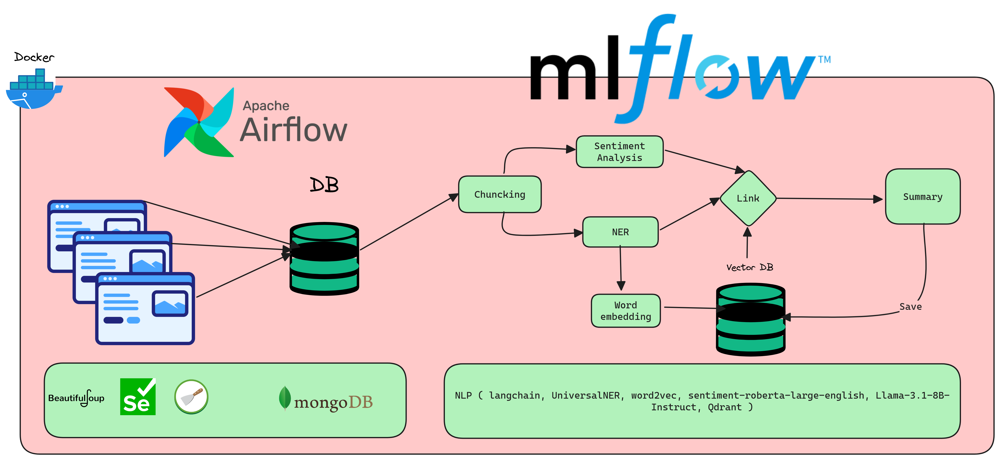

### Background and Problem Statement

Agriculture is vital to global food security, yet plant diseases are a major challenge, causing significant losses annually. In Morocco, where agriculture supports 80% of the rural population and contributes 14% to the GDP [[1]](https://www.agriculture.gov.ma/sites/default/files/investors_guide_in_the_agricultural_sector_in_morocco.pdf), farmers face up to 50% [[2]](https://www.fao.org/plant-production-protection/about/en) crop loss due to diseases detected through traditional, error-prone visual inspections. These methods are costly and inefficient, particularly for small-scale farmers.

### Impact and Proposed Solution

The **Leaf Doctor AI** application uses artificial intelligence, to detect plant diseases. Farmers can photograph plants, receive diagnoses, and access tailored treatment suggestions. Leaf Doctor AI minimizes crop losses and promotes sustainable agriculture by enabling early detection.

The application features an **interactive community platform**, allowing farmers to share insights and advice, and an **intelligent disease treatment catalog** generated through advanced data pipelines and machine learning.

### Project Outcomes and Deliverables

- **Disease Detection**: Accurate diagnosis and classification of plant diseases.
- **Treatment Catalog**: Comprehensive database of diseases and recommended treatments (still not released yet).
- **Data Logging**: Save and monitor plant health diagnostics over time.
- **Interactive Farmer Community**: A Stack Overflow-like forum for knowledge exchange.
- **Scalable and User-Friendly**: Android and iOS compatibility with an intuitive interface.

### Details

- **Demo video**: https://drive.google.com/file/d/1mAf_qeB694fuSzBSajYx9JA32QYdnPZg/view?usp=drive_link
- **Presentation**: https://drive.google.com/file/d/1b79WftATKf4Zd9wmvk7ExonRcXEMc-oS/view?usp=drive_link
- **Pitch Video**:
- **Landing Page:** [https://leaf-doctor-page.onrender.com/](https://leaf-doctor-page.onrender.com/)
- **A video you should watch**: https://drive.google.com/file/d/1D0vMCeYXvd201EMgM7ApDC7FBIrrA31R/view?usp=drive_link

---

### Advanced Features

### Disease Treatment Catalog

The treatment catalog is built using an innovative data and machine learning pipeline:

1. **Data Pipeline**:
    - **Web Scraping**: Public agricultural data is scraped using Airflow and stored in a MongoDB database.
    - **Data Storage**: The scraped data is structured and stored for processing.
2. **ML Pipeline**:
    - **Chunking**: Text data is divided into manageable sections using LangChain.
    - **Sentiment Analysis**: Sentiment-RoBERTa-Large-English identifies sentiment polarity in each chunk.
    - **Named Entity Recognition (NER)**: UniversalNER extracts key entities like plant names, diseases, and chemicals.
    - **Word Embedding**: Entities are converted into embeddings using Word2Vec.
    - **Vector Database**: Qdrant matches entity embeddings to retrieve related content.
    - **Linking**: An LLM uses the retrieved content, entities, and sentiments to summarize each chunk concisely.
    - **Storage**: Summaries are saved back into the vector database for future queries.